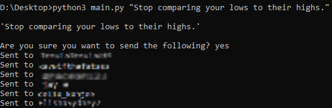

Message multiple people on Twitter.

SETUP:
First, get your API keys and tokens --> <a href="https://rapidapi.com/blog/how-to-use-the-twitter-api/">tutorial</a>
Then:
$ git clone https://github.com/Insula415/twitter-messaging/
$ pip3 install -r requirements.txt
$ cd twitter
$ python3 main.py "message you want to send"
Make sure to add the users' IDs into 'handles.txt' you can go to a website like <a href="https://codeofaninja.com/tools/find-twitter-id/">this</a> to find them.

