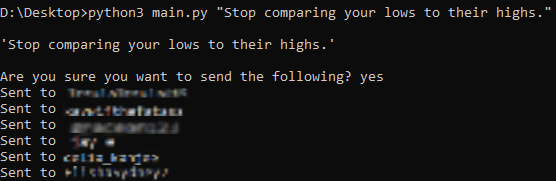
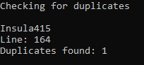

# Twitter mass messenger
Message multiple people on Twitter.

Checks for duplicates in handles:
 

SETUP:
First, get your API keys and tokens --> <a href="https://rapidapi.com/blog/how-to-use-the-twitter-api/">tutorial</a>

Then:
<li>$ git clone https://github.com/Insula415/twitter-messaging/</li>
<li>$ pip3 install -r requirements.txt</li>
Add the usernames to "handles.txt" (<b>Do not</b> include the @)
<li>$ cd twitter</li>
<li>$ python3 main.py "message you want to send"</li>

The user <b>must be</b> be following your account in order for you to message them.

